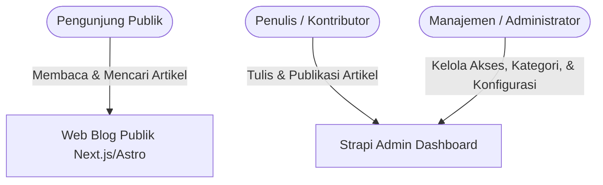

# 01. Executive Summary & Product Requirement Document (PRD)

| Metadata Proyek | Keterangan |
| :--- | :--- |
| **Nama Inisiatif** | Tech & Hobby Publishing CMS |
| **Versi Dokumen** | 1.0.0 (Tahap Perencanaan / MVP) |
| **Target Rilis MVP** | Q1 / 4-6 Minggu Pengerjaan |
| **Audiens Dokumen** | Tim Manajemen, Project Sponsor, Lead Developer, Head of Content |

---

## 1. Executive Summary (Ringkasan Eksekutif)

Inisiatif ini bertujuan untuk membangun platform publikasi artikel berbasis web mandiri (*self-hosted*) yang berfokus pada konten teknologi dan hobi. Dengan mengadopsi arsitektur modern **Headless CMS (Strapi)** yang dipadukan dengan **Frontend Berperforma Tinggi (Next.js / Astro)**, platform ini dirancang untuk:
1. **Memaksimalkan Pengalaman Pembaca**: Waktu muat halaman instan (< 1.2 detik), skor SEO tinggi, navigasi bersih, dan bebas distraksi iklan/fitur lambat.
2. **Efisiensi Tim Penulis**: Antarmuka penulisan berbasis blok yang modern, mendukung penulisan kode sumber teknis (*code snippets*) secara visual, dan alur publikasi instan (*Direct Publish*).
3. **Efisiensi Biaya & Kepemilikan Data Penuh**: Tidak bergantung pada biaya langganan platform pihak ketiga (SaaS CMS bulanan), dengan database dan aset yang dikontrol 100% oleh tim internal.

---

## 2. Visi Produk & Sasaran Bisnis

### 2.1 Visi Produk
Menjadi media publikasi rujukan untuk artikel teknis, tutorial pemrograman, ulasan teknologi, dan catatan hobi yang memiliki kualitas presentasi konten terbaik di kelasnya.

### 2.2 Sasaran Strategis & Metrik Keberhasilan (KPIs)

| Metrik | Target MVP | Dampak Bisnis |
| :--- | :--- | :--- |
| **Core Web Vitals (LCP)** | < 1.2 detik | Peringkat SEO Google optimal & retensi pembaca tinggi |
| **Google Lighthouse Score** | 95+ (Performance, SEO, Accessibility) | Kredibilitas teknis dan visibilitas organik |
| **Waktu Publikasi Artikel** | < 3 menit dari penulisan ke live | Produktivitas tim penulis meningkat drastis |
| **Biaya Operasional Server** | Hemat (< $15-$25/bulan di VPS/Cloud) | Efisiensi anggaran manajemen |

---

## 3. Profil Pengguna (User Personas)

1. **Pembaca Publik (Tech Enthusiast / General Reader)**:
   - *Kebutuhan*: Membaca tutorial dengan kode yang mudah disalin, artikel rapi, cepat diakses dari mobile/desktop, serta fitur pencarian cepat.
2. **Penulis / Kontributor (Author)**:
   - *Kebutuhan*: Editor visual yang intuitif, kemudahan format blok kode dan gambar, auto-save agar tidak hilang data, dan tombol publikasi langsung.
3. **Manajemen / Admin**:
   - *Kebutuhan*: Memantau daftar artikel yang sudah terbit, mengatur struktur kategori/tag, mengelola akun tim penulis, serta memastikan platform stabil.

---

## 4. Ruang Lingkup Fitur (Product Scope)

### 4.1 Fitur Fase 1 (MVP — Minimum Viable Product)
Fitur wajib yang harus selesai pada rilis perdana:

* **Sistem Manajemen Konten (CMS Backend - Strapi)**:
  - Panel Admin siap pakai dengan autentikasi aman (JWT / Session).
  - Manajemen Artikel: Pembuatan, pengeditan, penyimpanan draft, dan *direct publishing*.
  - Rich Block Editor: Dukungan paragraf, heading 1-3, blockquote, callout alerts, blok kode bersintaks, media gambar (upload & URL eksternal), serta embed video (YouTube/Vimeo).
  - Manajemen Taksonomi: Kategori utama dan label tags.
  - Manajemen Media: Upload gambar dengan optimasi otomatis dan penyimpanan cloud.
* **Portal Publikasi (Frontend Web - Next.js / Astro)**:
  - Halaman Beranda (*Home*): Menampilkan artikel pilihan (*featured*) dan daftar artikel terbaru.
  - Halaman Detail Artikel: Tampilan artikel bersih, pemutar video embed responsif (16:9 lazy load), estimasi waktu baca (*reading time*), Table of Contents (TOC) otomatis, dan tombol salin kode (*copy code snippet*).
  - Fitur Pencarian & Filter: Pencarian judul/konten instan dan filter berdasarkan Kategori atau Tag.
  - Tampilan Tema: *Dark Mode* dan *Light Mode* toggle.
  - SEO Otomatis: Dynamic Meta Tags, OpenGraph (pratinjau media sosial), dan auto-generated `sitemap.xml` & RSS feed.

### 4.2 Fitur Fase 2 (Pengembangan Lanjutan / Pasca-MVP)
* Integrasi sistem komentar berbasis GitHub/Discussions (Giscus) jika interaksi komunitas dibutuhkan.
* Analisis pembaca internal (*custom view analytics* sederhana).
* Fitur Newsletter subscription (integrasi Substack / Mailchimp / Resend).
* Scheduled publishing otomatis pada tanggal/jam tertentu di masa depan.

---

## 5. Matriks Peran & Hak Akses (User Roles & Permissions)

| Fitur / Tindakan | Public Reader | Author / Penulis | Super Admin (Manajemen) |
| :--- | :---: | :---: | :---: |
| Membaca artikel terbit | ✅ | ✅ | ✅ |
| Mencari & filter artikel | ✅ | ✅ | ✅ |
| Mengakses Dashboard Admin | ❌ | ✅ | ✅ |
| Membuat & mengedit artikel sendiri | ❌ | ✅ | ✅ |
| Menerbitkan artikel (*Publish*) | ❌ | ✅ | ✅ |
| Mengedit / menghapus artikel orang lain | ❌ | ❌ | ✅ |
| Mengelola Kategori & Tag induk | ❌ | Read-only | ✅ (Full CRUD) |
| Mengelola Pengguna & Hak Akses | ❌ | ❌ | ✅ |
| Mengubah konfigurasi sistem/API | ❌ | ❌ | ✅ |

---

## 6. Kriteria Keberhasilan & Batasan (Constraints)

* **Deployment Kontainer Mandiri (Docker)**: Seluruh arsitektur berjalan di server pribadi menggunakan Docker Compose (Strapi, PostgreSQL, dan Next.js) dengan persistensi data via Docker Named Volumes.
* **Standar Runtime & Tooling (Bun)**: Mengadopsi Bun 1.x sebagai package manager dan execution runtime untuk efisiensi build dan instalasi dependensi kilat.
* **Keamanan Ingress (Cloudflare Tunnel)**: Akses publik diarahkan melalui Cloudflare Tunnel yang sudah aktif di server tanpa perlu membuka port publik (port forwarding) di router lokal (*Zero Open Ports*), dilengkapi perlindungan DDoS dan sertifikat SSL otomatis.
* **Ketersediaan (*Availability*)**: Blog frontend terpisah dari CMS, sehingga jika backend Strapi sedang maintenance atau restart, website blog publik tetap dapat diakses normal berkat fitur static caching (SSG/ISR).
