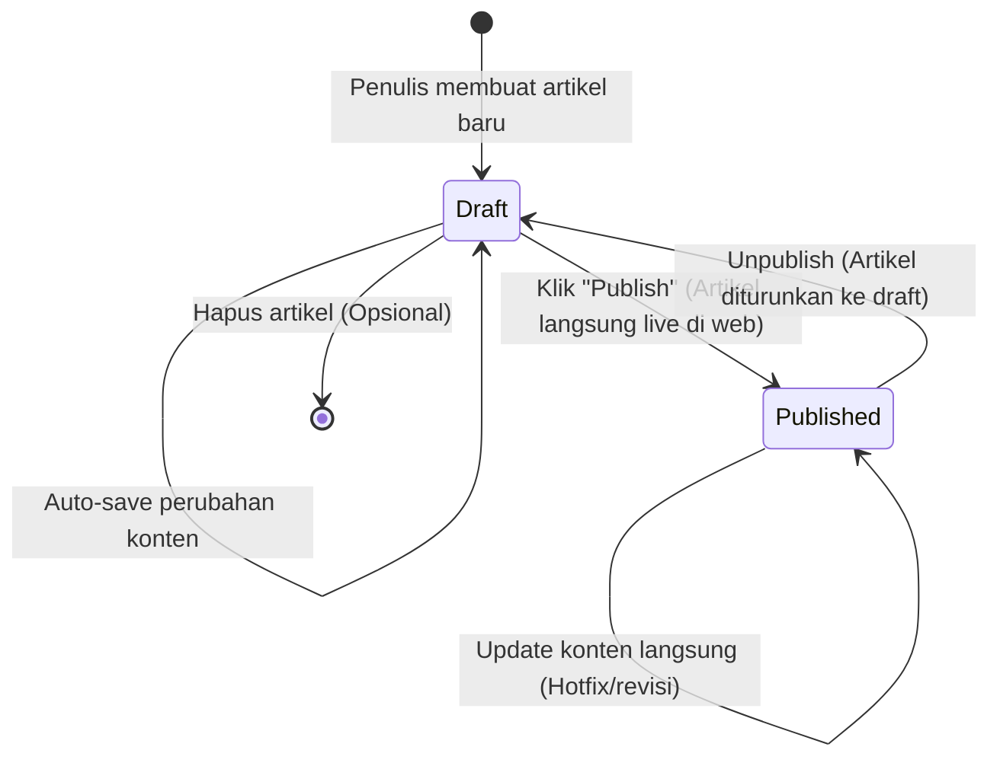

# 02. Panduan & Alur Kerja Editorial (Editorial Workflow & Guide)

| Metadata Dokumen | Keterangan |
| :--- | :--- |
| **Target Pengguna** | Tim Editor, Penulis Konten (Author), Kontributor Tamu |
| **Fokus Panduan** | Penggunaan Editor, Standar Format Konten, & Prosedur Penerbitan |
| **Versi** | 1.0.0 |

---

## 1. Siklus Hidup Artikel (Article Lifecycle)

CMS ini mengadopsi model **Alur Mandiri (Direct Publish)** untuk mempercepat proses penerbitan tanpa birokrasi berbelit.



1. **Draft (Konsep)**:
   * Artikel tersimpan aman di sistem dan **tidak dapat dilihat** oleh pembaca publik.
   * Auto-save berjalan otomatis untuk mencegah kehilangan data akibat kendala teknis atau koneksi.
2. **Published (Terbit)**:
   * Penulis dapat langsung menekan tombol **"Publish"**.
   * Web frontend akan memperbarui halaman dalam hitungan detik (*instant revalidation*).
3. **Unpublish / Revert**:
   * Jika ada kesalahan fatal atau informasi usang, penulis/admin dapat mengembalikan status menjadi Draft seketika untuk perbaikan.

---

## 2. Fitur & Pengalaman Menulis (Editor Experience)

Editor CMS menggunakan antarmuka **Rich Block Editor** modern yang fleksibel:

### 2.1 Blok Standar
* **Heading (H2, H3, H4)**: Penataan struktur hierarki artikel (H1 digunakan khusus untuk Judul Utama).
* **Paragraf & Tipografi**: Bold, italic, strikethrough, underline, inline code (\`code\`), dan hyperlink.
* **List**: Bullet points dan numbered lists.
* **Kutipan (Blockquote)**: Untuk kutipan ucapan narasumber atau referensi eksternal.

### 2.2 Blok Khusus Artikel Teknologi & Hobi
* **VS Code Style Code Block**:
  - **Cara Menambahkan**:
    - Ketik slash command `/vscode` pada baris baru, atau
    - Klik tombol `+` di sisi kiri editor lalu pilih **VS Code Block**, atau
    - Ketik shortcut ` ```vscode ` lalu tekan tombol <kbd>Spasi</kbd>.
  - **Fitur Interaktif Penulisan**:
    - **Active File Tab**: Penulis dapat memberi nama file spesifik (contoh: `app.tsx`, `docker-compose.yml`, `main.py`).
    - **Language Selector Dropdown**: Pilihan 15+ bahasa pemrograman (TypeScript, JavaScript, Python, Bash, SQL, Go, Rust, Java, C++, PHP, HTML, CSS, JSON, YAML, Markdown).
    - **Real-Time Syntax Highlighting**: Pewarnaan kode tematik VS Code Dark+ langsung aktif saat mengetik di admin panel.
    - **Line Numbers Gutter**: Kolom nomor baris otomatis bertambah dinamis seiring baris kode bertambah.
    - **Smart Indentation**: Menekan tombol <kbd>Tab</kbd> di area penulisan kode menyisipkan 2 spasi tanpa memindahkan fokus kursor.
  - **Tampilan Pembaca (Frontend)**: Blok kode dirender dengan antarmuka bergaya jendela editor VS Code lengkap dengan 3 titik Mac (merah, kuning, hijau), nama berkas, nomor baris, badge bahasa, dan tombol **"Copy"** interaktif satu klik.
* **Callout & Alert Box**:
  - Blok penekanan informasi penting dengan berbagai level warna:
    - 💡 **Info / Tip**: Catatan tambahan yang berguna bagi pembaca.
    - ⚠️ **Warning**: Peringatan potensi kendala teknis atau perubahan versi library.
    - 🛑 **Danger / Caution**: Peringatan kritis (misal: perintah terminal yang menghapus data).
* **Media & Gambar (Upload & URL Eksternal)**:
  - **Upload Mandiri**: Upload gambar langsung ke media library dengan fitur *drag & drop*.
  - **Embed URL Gambar**: Menyematkan gambar langsung via tautan URL eksternal tanpa harus mengunggah file.
  - Dilengkapi input *Caption* (keterangan gambar) dan *Alt Text* (wajib untuk aksesibilitas & SEO Google).
* **Blok Embed Video & Media Eksternal**:
  - **Embed Video (YouTube & Vimeo)**: Penulis cukup menempelkan (*paste*) URL video (contoh: `https://www.youtube.com/watch?v=...` atau `https://youtu.be/...`).
  - **Pratinjau Otomatis**: Editor langsung menampilkan thumbnail pratinjau video di dalam canvas penulisan.
  - **Tampilan Pembaca**: Di halaman publik web blog, video otomatis dirender secara responsif (aspek rasio 16:9) dengan fitur *lazy load* (menggunakan *facade player* / `youtube-nocookie`) agar tidak memperlambat *initial page load*.
  - **Embed Media Tambahan (Opsional)**: Mendukung embed interaktif teknis seperti CodePen, CodeSandbox, atau Tweet/X.

---

## 3. Standar Kelengkapan Metadata & SEO

Sebelum mempublikasikan artikel, penulis diwajibkan melengkapi panel sidebar metadata berikut:

| Bidang (Field) | Standar & Ketentuan | Contoh |
| :--- | :--- | :--- |
| **Title (Judul)** | Maksimal 60 karakter, menarik, memuat kata kunci utama. | *Panduan Lengkap Setup Docker untuk Pemula di 2026* |
| **Slug (URL)** | Otomatis dibuat dari judul (*kebab-case*), dapat disunting manual. | `panduan-lengkap-setup-docker-pemula` |
| **Excerpt (Ringkasan)** | 1-2 kalimat (120-155 karakter). Digunakan untuk pratinjau kartu blog dan deskripsi Google Search. | *Pelajari cara menginstal, menjalankan container pertama, dan memahami docker-compose secara praktis.* |
| **Cover Image** | Rasio 16:9 (disarankan 1200x630 px) dengan ukuran di bawah 300KB. | Gambar ilustrasi Docker berkualitas tinggi. |
| **Kategori Utama** | Pilih 1 kategori induk yang paling relevan. | `DevOps` atau `Tutorial` |
| **Tags** | 2-5 label spesifik untuk mempermudah pencarian. | `docker`, `containers`, `linux`, `beginner` |

---

## 4. Panduan Format Penulisan Terbaik (Content Best Practices)

1. **Struktur Artikel yang Teratur**:
   - Awali dengan pengantar ringkas: apa yang akan dipelajari dan siapa target pembacanya.
   - Gunakan Heading bertingkat agar pembaca dan fitur **Auto Table of Contents (TOC)** dapat mengindeks bagian artikel secara akurat.
2. **Kualitas Code Block**:
   - Selalu sertakan baris komentar singkat di dalam kode untuk menjelaskan logika penting.
   - Hindari memasukkan kredensial rahasia (API Key, password, token) di dalam snippet contoh.
3. **Efisiensi Gambar**:
   - Gunakan format modern seperti `.webp` atau `.png` yang telah dikompresi.
   - Pastikan teks dalam screenshot terlihat jelas baik di layar monitor maupun smartphone.
4. **Praktik Terbaik Embed Video & Media Eksternal**:
   - Pastikan video YouTube yang disematkan berstatus *Public* atau *Unlisted* (jangan gunakan status *Private*).
   - Gunakan video YouTube sebagai pelengkap visual tutorial (misal: demo jalannya aplikasi atau cuplikan ulasan hobi).
   - Untuk embed gambar via URL eksternal, pastikan tautan berasal dari CDN/host yang reliabel (misal: GitHubusercontent, Unsplash) agar gambar tidak rusak (*broken link*) di kemudian hari.
