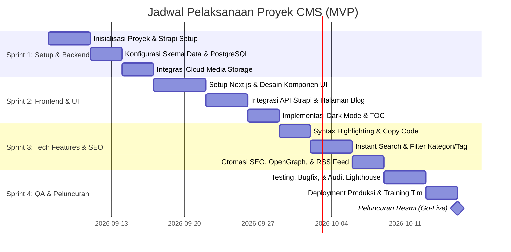

# 04. Rencana Kerja & Jadwal Pelaksanaan (Project Roadmap & Timeline)

| Metadata Pelaksanaan | Keterangan |
| :--- | :--- |
| **Estimasi Total Durasi** | 4 - 6 Minggu (4 Sprint) |
| **Metodologi** | Agile / Scrum Bertahap |
| **Target Akhir** | Peluncuran MVP Siap Produksi (Production-Ready) |
| **Audiens** | Tim Manajemen, Project Manager, Tim Engineer, Tim Konten |

---

## 1. Timeline & Pembagian Sprint (4 Minggu Kerja)

---

## 2. Rincian Pekerjaan Tiap Sprint (Sprint Backlog)

### Sprint 1: Pondasi Backend & Database (Minggu 1)
* [ ] Setup repositori monorepo/polyrepo (Strapi + Next.js) berbasis runtime/package manager **Bun**.
* [ ] Setup Docker Compose lokal untuk database PostgreSQL 16 (menggunakan named volume `postgres_data`).
* [ ] Inisialisasi Strapi v4/v5 via Bun (`bun install`) dan koneksi ke PostgreSQL.
* [ ] Pembuatan Content-Types (`articles`, `categories`, `tags`, `authors`) lengkap dengan blok kode, embed YouTube, & URL gambar.
* [ ] Konfigurasi upload provider untuk media (lokal volume atau cloud storage).
* [ ] Pengujian hak akses pengguna (*Admin* dan *Author*) di panel dashboard Strapi.

### Sprint 2: Frontend & Tampilan Dasar Blog (Minggu 2)
* [ ] Setup Next.js (App Router) via Bun (`bun create next-app`) dengan Tailwind CSS / styling modern.
* [ ] Pembuatan komponen UI dasar (Navbar, Footer, Blog Card, Category Badge).
* [ ] Halaman Beranda (*Home*): Mengambil dan menampilkan artikel terbit via Strapi REST API.
* [ ] Halaman Detail Artikel: Rendering Rich Text, heading, dan paragraf dengan tipografi bersih.
* [ ] Implementasi tema *Dark Mode* dan *Light Mode* yang tersimpan di preferensi browser pembaca.

### Sprint 3: Fitur Khusus Artikel Teknologi & SEO (Minggu 3)
* [ ] Integrasi Syntax Highlighter (Prism.js / Shiki) untuk blok kode teknis beserta tombol *Copy to Clipboard*.
* [ ] Integrasi responsive video embed player (YouTube/Vimeo 16:9 lazy load).
* [ ] Fitur *Auto Table of Contents* (TOC) yang menyorot posisi scroll pembaca secara otomatis.
* [ ] Kalkulasi estimasi waktu baca (*Reading Time*) otomatis berdasarkan jumlah kata.
* [ ] Fitur pencarian instan sisi klien (*instant search modal*) dan navigasi filter Kategori/Tag.
* [ ] Konfigurasi dynamic OpenGraph metadata (gambar pratinjau Twitter/WhatsApp) dan auto-generate `sitemap.xml` & `feed.xml` (RSS).

### Sprint 4: Containerization Docker, Deployment Server, & Go-Live (Minggu 4)
* [ ] Pembuatan multi-stage Dockerfile untuk Strapi (`backend/Dockerfile`) dan Next.js (`frontend/Dockerfile`).
* [ ] Konfigurasi `docker-compose.yml` di server pribadi (orkestrasi Postgres, Strapi, Frontend, dan persistent named volumes).
* [ ] Integrasi routing ingress ke container **Cloudflare Tunnel (`cloudflared`)** yang sudah aktif di server untuk domain publik blog & CMS.
* [ ] Konfigurasi Webhook Strapi $\rightarrow$ Next.js untuk *On-Demand Revalidation* (ISR).
* [ ] Audit performa Google Lighthouse (memastikan skor > 95 pada Mobile & Desktop).
* [ ] Uji coba pembuatan artikel oleh tim penulis langsung di server produksi pribadi.
* [ ] Peluncuran resmi (*Go-Live*).

---

## 3. Matriks Peran & Tanggung Jawab (RACI Matrix)

* **R (Responsible)**: Pelaksana tugas utama.
* **A (Accountable)**: Penanggung jawab hasil akhir keputusan.
* **C (Consulted)**: Pihak yang dimintai masukan/feedback.
* **I (Informed)**: Pihak yang menerima laporan perkembangan.

| Area Tugas | Manajemen / Sponsor | Lead Developer | Tim Penulis / Editor |
| :--- | :---: | :---: | :---: |
| Persetujuan Ruang Lingkup & Anggaran | **A** | C | I |
| Desain Arsitektur & Setup Server | I | **A / R** | I |
| Konfigurasi Kategori & Struktur Konten | C | R | **A** |
| Pengembangan Antarmuka (UI/UX) Frontend | C | **A / R** | C |
| Pengujian Fitur Editor & Penulisan | I | C | **A / R** |
| Peluncuran Produksi (Go-Live) | **A** | R | I |

---

## 4. Kriteria Kelayakan Rilis (Definition of Done - DoD MVP)

Aplikasi dinyatakan siap diserahterimakan dan diluncurkan ke publik jika:
1. Penulis berhasil membuat artikel dengan blok kode, mengunggah gambar, dan mempublikasikannya langsung dari dashboard Strapi tanpa kendala teknis.
2. Artikel yang diterbitkan muncul di halaman web publik dalam waktu kurang dari 5 detik setelah disimpan.
3. Halaman blog lolos uji performa Google Lighthouse dengan skor minimal 90 di semua metrik.
4. Fitur pencarian instan, filter kategori, auto-TOC, copy code, dan dark/light mode berfungsi mulus di perangkat desktop dan ponsel pintar.
